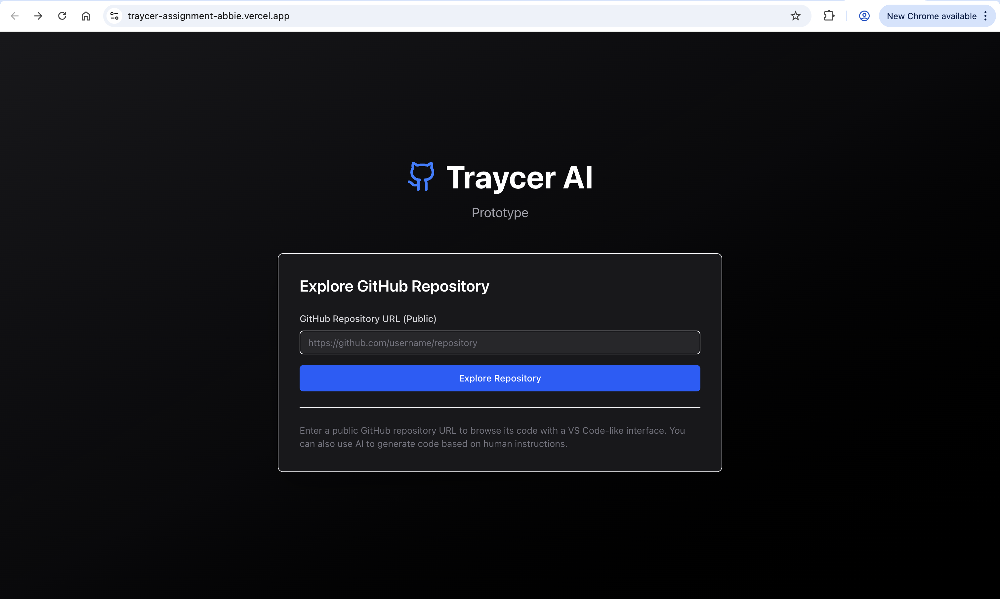
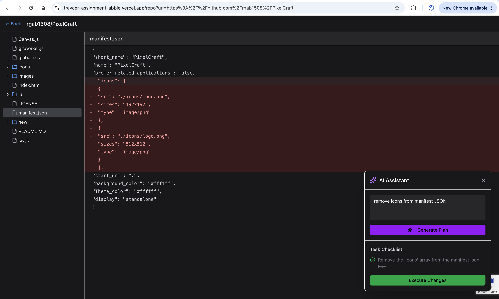

# Traycer AI - MVP Prototype

A browser-based proof-of-concept demonstrating AI-powered code planning and modification. This MVP showcases the core concept of "plan-first, code-second" development where AI analyzes codebases, generates human-readable change plans, and produces code modifications—all reviewable before implementation.



## About This Prototype

This is a simplified MVP built to demonstrate the foundational workflow of [Traycer AI](https://traycer.ai), a spec-driven development platform that orchestrates coding agents. While the full Traycer product offers advanced features like phase-based planning, agent orchestration, implementation verification, and iterative refinement, this prototype focuses on three essential flows:

1. **Code Ingestion** - Connect to any public GitHub repository
2. **AI Planning** - Generate step-by-step change plans from natural language
3. **Code Generation** - Produce reviewable code diffs using AI function calling

**Key Differences from Full Traycer:**
- No user management or authentication
- Single-shot planning (no multi-phase workflows)
- No agent orchestration or handoff to external tools
- No verification/iteration loops
- Simplified UI for investor demos

## Core Features



**Repository Browser**
- Connect to public GitHub repositories via URL
- VS Code-like file explorer with folder navigation
- Monaco Editor for syntax-highlighted code viewing
- Automatic branch detection (main/master)

**AI-Powered Planning**
- Natural language task input via floating assistant panel
- Google Gemini 2.5 Flash for plan generation
- Automatic task breakdown into actionable checklist
- Context-aware planning using current file content

**Code Modification**
- AI function calling to generate code changes
- Fetches relevant file contents automatically
- Produces complete modified file content
- Side-by-side diff viewer for reviewing changes
- No actual file writes (view-only for safety)

**Security**
- Google reCAPTCHA v2 Invisible protection on all API endpoints
- Automatic bot detection without user interaction
- Challenge-based verification (invisible to legitimate users)

## Tech Stack

- **Next.js 15** with App Router and Turbopack
- **TypeScript** for type safety
- **Tailwind CSS v4** for styling
- **shadcn/ui** for UI components
- **Monaco Editor** for code display
- **Google Gemini API** for AI planning and code generation
- **GitHub REST API** for repository access
- **Google reCAPTCHA v2 Invisible** for bot protection

## Setup Instructions

### 1. Install dependencies

```bash
npm install
```

### 2. Configure API Keys

Create a `.env.local` file in the project root:

```bash
touch .env.local
```

**GitHub Personal Access Token** (Optional - increases rate limits):
1. Visit [GitHub Settings → Personal access tokens](https://github.com/settings/tokens)
2. Generate new token (classic)
3. Select `public_repo` scope for public repositories
4. Copy the generated token

**Gemini API Key** (Required for AI features):
1. Visit [Google AI Studio](https://aistudio.google.com/app/apikey)
2. Click "Create API Key"
3. Copy the generated key

**reCAPTCHA v2 Invisible Keys** (Required for API protection):
1. Visit [Google reCAPTCHA Admin Console](https://www.google.com/recaptcha/admin/create)
2. Register a new site with reCAPTCHA v2 Invisible
3. Add your domain (use `localhost` for development)
4. Copy both the Site Key and Secret Key

Add all keys to `.env.local`:

```env
GITHUB_TOKEN=ghp_your_token_here
GEMINI_API_KEY=your_gemini_key_here
RECAPTCHA_SITE_KEY=your_site_key_here
RECAPTCHA_SECRET_KEY=your_secret_key_here
```

### 3. Run the development server

```bash
npm run dev
```

Open [http://localhost:3000](http://localhost:3000) to view the app.

## Usage

### Basic Repository Browsing
1. Enter a public GitHub repository URL (e.g., `https://github.com/vercel/next.js`)
2. Click "Explore Repository"
3. Browse files in the left sidebar
4. Click any file to view its contents in the Monaco Editor

### AI-Powered Code Editing
1. Click the purple AI sparkle button (bottom-right corner)
2. Enter natural language instructions (e.g., "Add error handling to the API routes")
3. Click "Generate Plan" - AI creates a task checklist
4. Review the checklist
5. Click "Execute Changes" - AI generates code modifications
6. View the diff to see proposed changes

## Project Structure

```
├── app/
│   ├── api/
│   │   ├── github/
│   │   │   ├── tree/      # Fetch repo file tree
│   │   │   └── file/      # Fetch individual file content
│   │   └── ai/
│   │       ├── checklist/ # Generate task checklist with Gemini
│   │       └── modify/    # Generate code modifications with function calling
│   ├── repo/              # Repository viewer page with AI integration
│   ├── globals.css
│   ├── layout.tsx
│   └── page.tsx           # Landing page
├── components/
│   ├── ui/                # shadcn components
│   ├── file-explorer.tsx  # File tree sidebar
│   ├── code-editor.tsx    # Monaco editor wrapper
│   ├── diff-viewer.tsx    # Diff viewer for code changes
│   └── ai-panel.tsx       # Floating AI assistant panel
├── lib/
│   ├── types.ts           # TypeScript types
│   ├── ai-types.ts        # AI-specific types
│   ├── file-tree.ts       # File tree utilities
│   └── utils.ts           # General utilities
```

## API Routes

### GET `/api/github/tree`
Fetches the complete file tree of a repository.

**Query Parameters:**
- `owner` - Repository owner
- `repo` - Repository name
- `branch` - Branch name (default: main)

### GET `/api/github/file`
Fetches the content of a specific file.

**Query Parameters:**
- `owner` - Repository owner
- `repo` - Repository name
- `path` - File path
- `branch` - Branch name (default: main)

### POST `/api/ai/checklist`
Generates a task checklist from natural language instructions using Gemini.

**Request Body:**
- `instruction` - Natural language description of what to do
- `repoOwner` - Repository owner
- `repoName` - Repository name
- `branch` - Branch name
- `currentFilePath` - (Optional) Currently viewed file
- `currentFileContent` - (Optional) Content of current file

### POST `/api/ai/modify`
Generates code modifications using Gemini function calling.

**Request Body:**
- `sessionId` - Session ID from checklist generation
- `checklist` - Array of tasks
- `fileTree` - List of files in repository
- `fileContents` - Map of file paths to their contents

## Deployment on Vercel

1. Push your code to GitHub
2. Import the project in [Vercel](https://vercel.com)
3. Add environment variables:
   - `GITHUB_TOKEN` - Your GitHub personal access token
   - `GEMINI_API_KEY` - Your Gemini API key
   - `RECAPTCHA_SITE_KEY` - Your reCAPTCHA site key
   - `RECAPTCHA_SECRET_KEY` - Your reCAPTCHA secret key
4. Update reCAPTCHA domain in Google Admin Console to include your Vercel domain
5. Deploy!

## Notes

- The app works with public repositories without a GitHub token, but rate limits are lower
- With a GitHub token, you get higher rate limits (5,000 requests/hour)
- The GitHub API has a 100,000 file limit for recursive tree fetching
- Gemini API has rate limits - if you hit them, wait a few seconds and try again
- The AI feature uses Gemini 2.5 Flash model with function calling for code modifications
- reCAPTCHA v2 Invisible runs in the background - no user interaction for legitimate users
- All API endpoints are protected with reCAPTCHA verification
